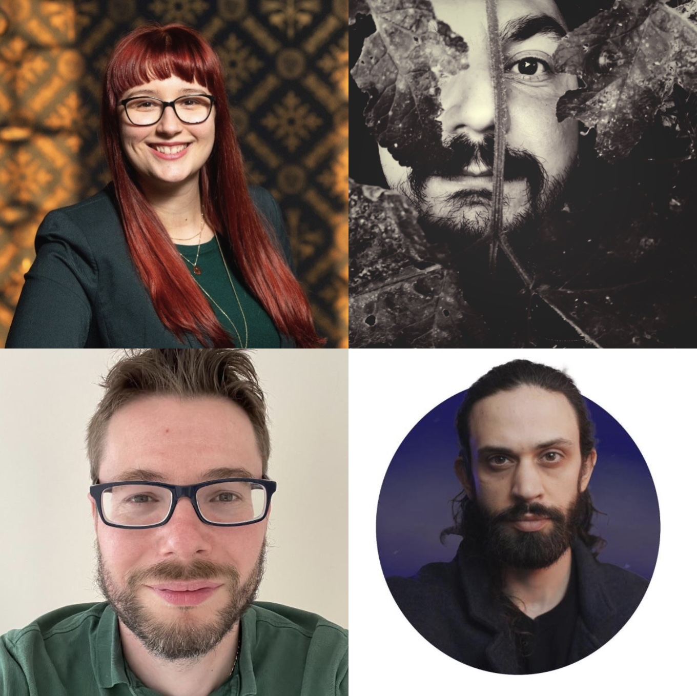
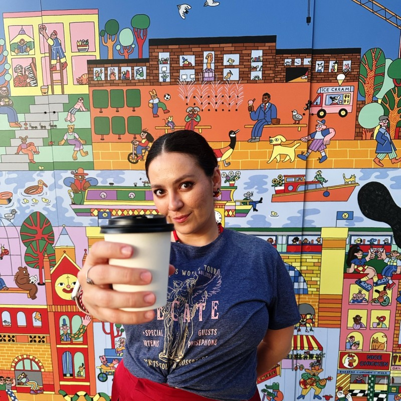

<a name="top"/>

- This seminar series is partially supported by the [PHAWM](https://phawm.org) research project, funded by [Responsible AI UK](https://rai.ac.uk).
- This seminar series is hosted in partnership with the StirAI multidisciplinary research lab at the [University of Stirling](https://www.stir.ac.uk).
- Some of these seminars are also part of the [Computing Science and Mathematics](https://www.stir.ac.uk/about/faculties/natural-sciences/computing-science-mathematics/) seminar series of the [University of Stirling](https://www.stir.ac.uk).

---

<!--
 

-->

## Schedule

<a name="top"/>

1. [2026](#2026)
<!--   - [April](#government): AI & Government-->
   - [March](#media): AI & Media
   - [February](#language): AI & Language
   - [January](#coding): AI & Coding
3. [2025](#2025)
   - [Autumn](#autumn2025): AI & Gender
   - [Spring](#spring2025): AI & Governance
4. [2024](#2024)
   - [Autumn](#autumn2024): AI & Metrics
  
--- 

<a name="spring2026"/>

<!-- <a name="government"/>

## AI & Government

  

   

      
   

   

      <h3>Upcoming</h3>
       
      <blockquote>"tools often created with positive or neutral intentions can still reinforce stereotypes, deepen inequalities and create new forms of harassment and exclusion"</blockquote> 
       
      <i><a href="https://www.linkedin.com/in/albertofranzin/">Alberto Franzin</a> @ EU AI Officee</i>
   
   

[Back to the top](#top)

---
-->
<a name="media"/>

## AI & Media

  

   

      
   

   

      <h3>Upcoming</h3>
       
      <!-- <blockquote>"tools often created with positive or neutral intentions can still reinforce stereotypes, deepen inequalities and create new forms of harassment and exclusion"</blockquote> -->
       
      <i><a href="https://www.linkedin.com/in/anna-rezk/">Anna Rezk-Parker</a> @ University of Glasgow</i>
   
   

[Back to the top](#top)

---

<a name="language"/>

## AI & Language

  

   

      
   

   

      <h3>Upcoming</h3>
       
      <!-- <blockquote>"tools often created with positive or neutral intentions can still reinforce stereotypes, deepen inequalities and create new forms of harassment and exclusion"</blockquote> -->
       
      <i><a href="https://www.linkedin.com/in/ronchrisley/">Ron Chrisley</a> @ University of Sussex</i>
   
   

<!-- <table>
   <tr>
      <td width=350 class="picture">
         
      </td>
      <td width=320>
         <h3>Upcoming</h3>
          
         <blockquote>"tools often created with positive or neutral intentions can still reinforce stereotypes, deepen inequalities and create new forms of harassment and exclusion"</blockquote>
          
         <i><a href="https://www.linkedin.com/in/ronchrisley/">Ron Chrisley</a> @ University of Sussex</i>
      </td>
   </tr>
</table> -->

---

<a name="coding"/>

## AI & Coding

  

   

      
   

   

      <h3>Vibe Coding in Higher Education: Experiences, Scenarios, and Sociotechnical Considerations</h3>
       
      <blockquote>"if you have an idea and want to get feedback on the concept and general idea, then I think vibe coding can fast track the process significantly"</blockquote>
       
      <i><a href="https://www.linkedin.com/in/michaelahruskova/">Michaela Hruskova</a>, <a href="https://www.linkedin.com/in/vassilis-galanos-4a39a955/">Vassilis Galanos</a>, <a href="https://www.stir.ac.uk/people/2013555">Simon Powers</a> & <a href="https://www.stir.ac.uk/people/1784983">Conor McKeown</a> @ University of Stirling</i>
   
   

Code generation is one of the major applications of Large Language Models (LLMs), the most recent AI breakthrough that has drawn significant attention from society. Automating and popularizing coding has long been an aim of computer science, so now software companies and communities have coined the term "_vibe coding_" to promote LLM-based code generation. Indeed, _vibe coding_ became the Collins Dictionary word of the 2025 year, which evidences the hype around this approach. However, LLMs raise a number of concerns regarding their training, the aggressive behavior of their provider companies, and the sociotechnical effects they produce. In this meet-up, we will discuss _vibe coding_ scenarios and experiences in higher education and whether it could be a means for democratising access to coding. Importantly, we will also discuss the sociotechnical risks that should be considered in these scenarios, as well as eventual mitigation procedures that could be employed to address potential harms.   

_Michaela Hruskova, Vassilis Galanos, Simon Powers, and Conor McKeown are Lecturers at the University of Stirling. Michaela is a Lecturer in Entrepreneurship and Vassilis is a Lecturer in Digital Work, both at the Stirling Business School. In turn, Simon is a Lecturer in Trustworthy Computer Systems at the School of Computing Science & Mathematics, while Conor is a Lecturer in Digital Media at the School of Communications, Media and Culture. Along with multiple other academics at Stirling, they comprise the StirAI multidisciplinary research lab (formerly JustAI Lab)._

[Back to the top](#top)

--- 

<a name="autumn2025"/>

<a name="gender"/>

## AI & Gender

  

   

      
   

   

      <h3>Gender, Violence and Artificial Intelligence: How Generative AI Reproduces Violence Online</h3>
       
      <blockquote>"tools often created with positive or neutral intentions can still reinforce stereotypes, deepen inequalities and create new forms of harassment and exclusion"</blockquote>
       
      <i><a href="https://www.linkedin.com/in/carolline-querino/">Carolline Querino</a> @  Itaipu ParqueTec & Cajú Consultoria Nordestina</i>
   
   

<!-- 
<table>
   <tr>
      <td width=350 class="picture">
         
      </td>
      <td width=320>
         <h3>Gender, Violence and Artificial Intelligence: How Generative AI Reproduces Violence Online</h3>
          
         <blockquote>"tools often created with positive or neutral intentions can still reinforce stereotypes, deepen inequalities and create new forms of harassment and exclusion"</blockquote>
          
         <i><a href="https://www.linkedin.com/in/carolline-querino/">Carolline Querino</a> @  Itaipu ParqueTec & Cajú Consultoria Nordestina</i>
      </td>
   </tr>
</table> 
-->

In this seminar, I will present the first findings from my ongoing research on how generative AI, including chatbots, deepfakes and virtual assistants, can reproduce and amplify gender-based violence on social media. We will examine how tools often created with positive or neutral intentions can still reinforce stereotypes, deepen inequalities and create new forms of harassment and exclusion. After sharing the initial data, I will open the floor for a collective conversation on how we can imagine and design AI tools that do not reproduce gender-based violence or other forms of oppression, and instead contribute to building fairer, safer and more inclusive digital spaces.

_Carolline Querino is a specialist in Gender Mainstreaming, focusing on Artificial Intelligence in social media and Environmental Justice, with over eight years’ experience leading social impact projects across Latin America and Europe. As co-founder of Caju Consultoria Nordestina, she develops intersectional strategies that connect communities, public policies, and climate justice, always centring marginalised groups. Her research explores gender-based violence, misinformation, and the social impact of AI, with an emphasis on ethics and community-driven methodologies. She brings expertise in MEAL frameworks, advocacy, and participatory approaches, having collaborated with universities, grassroots movements, government bodies, and international organisations. She is a Chevening Scholar and holds a Master’s in Gender, Violence and Conflict from the University of Sussex._

[Back to the top](#top)

--- 

<a name="spring2025"/>

<a name="governance"/>

## AI & Governance

   
<!-- 
 
-->

   

            
   

   

      <h3>The challenges of digital ethics & responsible AI</h3>
       
      <blockquote>"organisations across the world are facing growing challenges in implementing responsible AI at scale"</blockquote>
       
      <i><a href="https://www.linkedin.com/in/wiktoria-kulik/">Wiktoria Kulik</a> @ Accenture UK </i>
   
   

<!-- 
<table>
   <tr>
      <td width=350 class="picture">
      </td>
      <td width=320>
         <h3>The challenges of digital ethics & responsible AI</h3>
          
         <blockquote>"organisations across the world are facing growing challenges in implementing responsible AI at scale"</blockquote>
          
         <i><a href="https://www.linkedin.com/in/wiktoria-kulik/">Wiktoria Kulik</a> @ Accenture UK </i>
      </td>
   </tr>
</table> 
-->

As adoption of Generative AI solutions increases and more regulatory scrutiny is given to AI more broadly, organisations across the world are facing growing challenges in implementing responsible AI at scale. This talk will explore the key challenges organisations encounter in adopting responsible AI, including establishment and operationalisation of key principles, and navigating evolving regulations. We will examine how organisations can build effective governance frameworks that balance innovation with ethical considerations, and the role of regulators in setting clear guidelines for AI deployment. Additionally, we will discuss the challenges of fostering a culture of responsibility within organisations, particularly in fast-moving AI environments. The session will provide practical insights on how to address these challenges and successfully integrate responsible AI practices at scale.

_Wiktoria Kulik is a Responsible AI Manager at Accenture, where she supports clients across multiple sectors in AI governance and responsible use of technology. She previously led Digital Ethics consulting at Sopra Steria, supporting clients in financial services and other sectors in embedding digital ethics solutions in their organisations. Wiktoria is a former policy advisor at the Centre for Data Ethics and Innovation, where she supported the launch of the UK-US Privacy Enhancing Technologies Prize Challenge and conducted research to enable the creation of trustworthy Smart Data ecosystem in the UK. She was also a member of the Oversight Group that advised the DARE UK programme. She has degrees in Philosophy and Computer Science, with specialisation in Speech and Language Processing, as well as significant experience in the tech sector._

[Back to the top](#top)

--- 

<a name="autumn2024"/>

<a name="metrics"/>

## AI & Metrics

  

   

      
   

   

      <h3>Mathematical models for dominance move: comparison and complexity analysis</h3>
       
      <blockquote>"dominance move is very intuitive but hard to calculate due to its combinatorial nature"</blockquote>
       
      <i><a href="https://www.linkedin.com/in/elizabeth-wanner-91607832/">Elizabeth Wanner</a> @ Aston University</i>
   
   

<!--
<table>
   <tr>
      <td width=350 class="picture">
         
      </td>
      <td width=320>
         <h3>Mathematical models for dominance move: comparison and complexity analysis</h3>
          
         <blockquote>"dominance move is very intuitive but hard to calculate due to its combinatorial nature"</blockquote>
          
         <i><a href="https://www.linkedin.com/in/elizabeth-wanner-91607832/">Elizabeth Wanner</a> @ Aston University</i>
      </td>
   </tr>
</table>
-->

Dominance move (DoM), a binary quality indicator, can be used in multi-objective and many-objective optimisation to compare two solution sets. DoM is very intuitive but hard to calculate due to its combinatorial nature. Different mathematical models are presented and analysed. A computationally fast approximate approach is also discussed. Computational results are promising and an upper bound analysis for the approximation ratio would be useful.  

_Elizabeth Wanner received her B.S. degree in Mathematics in 1994, and her M.Sc. in 2002, both from the Universidade Federal de Minas Gerais, where she also completed her Ph.D. in Electrical Engineering in 2006. Until December 2022, she served as an Associate Professor in the Department of Computer Engineering at the Centro Federal de Educação Tecnológica de Minas Gerais, in Belo Horizonte, Brazil. Since January 2023, she has been a Reader in Computer Science at Aston University, Birmingham, UK. Her research focuses on evolutionary computation, global optimization, constraint handling, and multiobjective optimization._

[Back to the top](#top)

